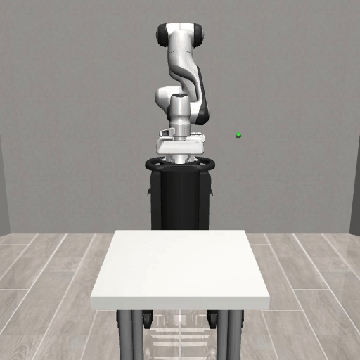
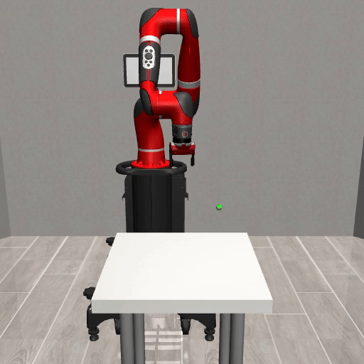

# cross_embodiment_transfer

1. Install packpages
```bash
pip install -r requirements.txt
```
2. Install robosuite fork 
```bash
git clone https://github.com/tianyudwang/robosuite
cd robosuite
pip install -e .
```

3. Data generation
```bash
python3 generate_demos.py --robot Panda
python3 generate_demos.py --robot Sawyer
```

4. Train source Panda robot policy
```bash
python3 train_bc.py --config configs/Reach/BC_JV.yml
```



5. Alignment on target Sawyer robot
```bash
python3 train_align.py --config configs/Reach/align.JV.yml
```

6. Visualize
```bash
python3 visualize.py --config configs/Sawyer/eval.yml
```




# Acknowledgements

We gratefully acknowledge support from the Technology Innovation Program (20018112, Development of autonomous manipulation and gripping technology using imitation learning based on visual and tactile sensing) funded by the Ministry of Trade, Industry & Energy (MOTIE), Korea.
